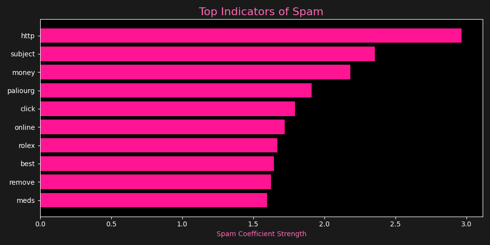

# 🎀 Python AI & ML Portfolio: Pink Edition

Experience the world of Python and Machine Learning through a vibrant, high-fidelity lens.

---

## 🛡️ SPAM SNIPER AI ENGINE
**Status: Complete** | **Vibe: Deep Pink** | **Accuracy: 97.68%**

This project uses Natural Language Processing (NLP) to classify messages as either "Spam" or "Ham" (Legitimate), presented in a premium "Cyber-Pink" interactive dashboard.

### 💖 Model Performance
We achieved a high accuracy of **97.68%** using `TfidfVectorizer` and `LogisticRegression` from the Scikit-Learn library.

#### Vibe Check Analytics
By scanning over 5,500 messages, the AI successfully isolated the most consistent signals of suspicious activity:

### 🛠️ Tech Stack
- **TF-IDF Vectorization**: Pink-encoded analysis of word importance across the dataset.
- **Custom Preprocessing**: Pipeline to cleanse and standardize message strings.
- **Cyber-Card Dashboard**: A stunning, responsive HTML report with modern glassmorphism.

### 📁 Project Files
Detailed implementation in the [`/logisticRegression`](./logisticRegression) directory:
- [`implementation.py`](./logisticRegression/implementation.py): The core logic and pink report engine.
- [`spam.csv`](./logisticRegression/spam.csv): The raw experimental data.
- [`index.html`](./logisticRegression/index.html): The standalone "Pink Sniper" dashboard.

---

*(Next Step: KNN Movie Recommender... ✨)*